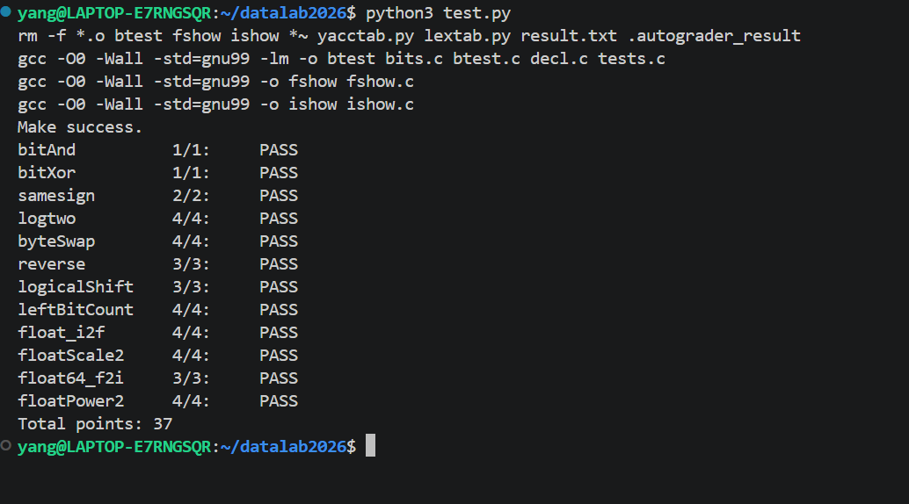

# datalab 报告

姓名：杨锦注

学号：2025200716

| 总分 | bitAnd | bitXor | samesign | logtwo | byteSwap | reverse | logicalShift | leftBitCount | float_i2f | floatScale2 | float64_f2i | floatPower2 |
| ---- | ------ | ------ | -------- | ------ | -------- | ------- | ------------ | ------------ | --------- | ----------- | ----------- | ----------- |
| 37.00 | 1.00 | 1.00 | 2.00 | 4.00 | 4.00 | 3.00 | 3.00 | 4.00 | 4.00 | 4.00 | 3.00 | 4.00 |


     

## 解题报告

### 亮点


1. logtwo
2. floatPower2
3. samesign

### logtwo

```c
int logtwo(int v) {
    int r = 0;       //r = 到目前一共找到了多少位
    int s;              //本次要位移多少位

    s = (v > 0xFFFF) << 4;   //判断在高16位还是低16位
    //若在高16位，则左移16位，即2^4
    v = v >> s;      //继续判断位于16位里的哪一部分，除以2^4
    r = r | s;         //又由于s是2^4,2^3,2^2,2^1, 2^0,所以|可以当作+用

    s = (v > 0xFF) << 3;
    v = v >> s;
    r = r | s;

    s = (v > 0xF) << 2;
    v = v >> s;
    r = r | s;

    s = (v > 0x3) << 1;
    v = v >> s;
    r = r | s;

    r = r | (v > 1);

    return r;
}
```

#### 题目思路
本质是找最高位 1 的位置，即 log2 的整数部分。做法是分区探索：先用 v > 0xFFFF 判断在高 16 位还是低 16 位，是则右移 16 位；再依次用 0xFF、0xF、0x3 判断 8、4、2 位。因为每段的位移量是 2 的幂且不重复，s 累加时可以用 | 代替 +。最后剩余 1 位，用 v > 1 直接判断是否补 1。

### floatPower2

```c
unsigned floatPower2(int x) {
    if (x < -149)    //单精度 float 能表示的最小正非零值
        return 0;
    if (x < -126)   //denormal 的 exponent 字段固定是：00000000
        return 1 << (x + 149);
    if (x <= 127)
        return (x + 127) << 23;
    return 0x7F800000u;
}
```
#### 题目思路
这题本质不难，但是很能检测你是否真的明白了exp的范围限制。当exp=1~254的时候就是normal，是正常的1.Fx2^exp - 127;如果exp = 0,就是denormal,是0.Fx2^-126,小数部分最小是2^-23,所以最小的denormal就是2^-149.

### samesign

```c
int samesign(int x, int y) {
    if(!(x && y))
        return !x && !y;
    x = x >> 31;
    y = y >> 31;
    if(x ^ y)
        return 0;
    else
        return 1;
}
```
#### 题目思路
这题逻辑本身简单，但我第一次用了 ||，被 test.py 判定违规。仔细看 Legal ops 才发现只给了 && 没给 ||，于是用德摩根律 A||B ≡ !(!A && !B) 改写后通过。这提醒我必须逐字核对可以用的操作符列表。

## 反馈/收获/感悟/总结

我做了大约两遍，第一遍因为是在上浮点数之前写的所以很痛苦，尤其是后面几道题目，我都不知道这些数是哪里来的。所以我花了3个小时写了后面几道浮点数题目，边理解概念，边写代码。总共差不多花了8个小时。我觉得最巧妙的地方在于，可以自己设计一个16进制取提取自己想要的信息。

## 参考的重要资料

- 《深入理解计算机系统》(CS:APP) 第 2 章「信息的表示和处理」
